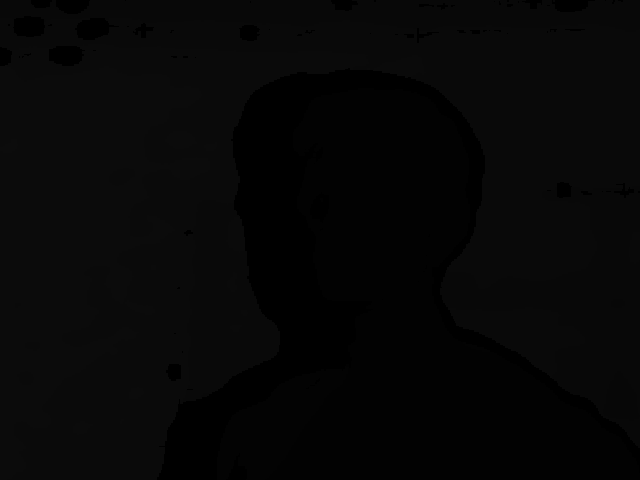
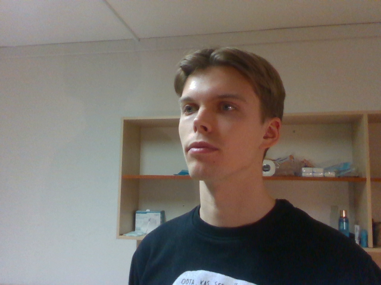
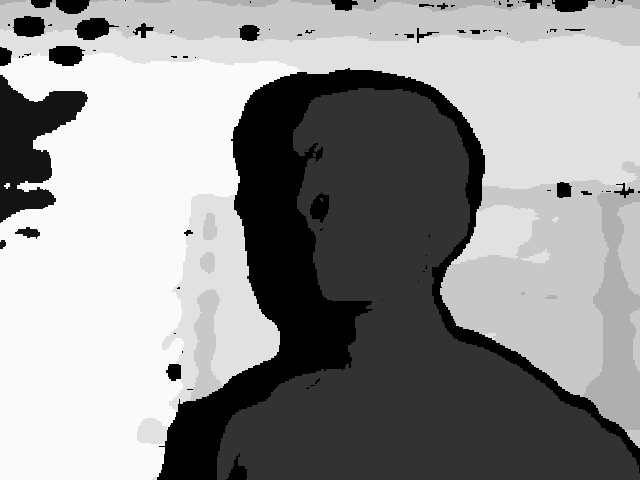

# RGB-DepthFacialRecognitionIdentification
<b>Students:</b> Ilmar Uduste, Eslem Güler, Christian Johansen
 <b>Course:</b> Computer Vision, POVa, Brno University of Technology

## Intel Realsense Depth Camera

To capture RGB and depth photos at the same time, we used an Intel Realsense Depth Camera with a resolution of 720p. Since the project team all had Macs, then we had loads of issues actually getting it running, but we finally managed it using Parallels to get a virtual machine running in Ubuntu. Here's an example of a RGB-D image pair:

The depth picture values each pixel with the distance in meters for that particular pixel. Bear in mind that these values are integers, so in a profile picture, the entire face might be just one contour. Here's the same depth picture with normalized values:

The inaccuracy of the depth image leads to the depth information being unusable in actual facial recognition or identification.

## Project plan
<ol>
  <li>Get a dataset of images with faces</li>
    <ol>
      <li>Record footage of at least 3 people with varying emotions and lighting condition</li>
      <li>Label images (name, gender, emotion etc)</li>
      <li>Divide the images into training, validation, test</li>
    </ol>
  <li>Do some OpenCV magic</li>
    <ol>
      <li>Recognize faces from the image</li>
      <li>Draw bounding boxes around the faces</li>
      <li>(Optional) Get the polygons/points of facial features (eyes, eyebrows, mouth etc)</li>
    </ol>
  <li>Build a model (Neural Network) on split dataset that has some OpenCV magic done</li>
    <ol>Find a suitable architecture for the NN
      <li>Decide whether we want a CNN or a regular NN</li>
      <li>Implement said NN</li>
      <li>Possibly have multiple neural networks for different features (name, gender, facial features separately)</li>
      <li>Account for showing images of people that are not in the original dataset (confidence level)
      <li>Train Neural Network on split dataset</li>
      <li>Export model</li>
    </ol>
  <li>Develop an application or Jupyter Notebook that uses the model, takes an input of an image and then outputs the name, emotion, gender etc of the person.</li>
    <ol>Develop prototype in Jupyter Notebook that does the same OpenCV magic before it feeds that information into the NN model and gets an output
      <li>(Optional) Display the output in a window</li>
      <li>(Optional) Have an input of a video and a continuous output (only achievable if performance is good enough).</li>
      <li>Verification</li>
    </ol>
  <li>Present our project in December</li>
</ol>
